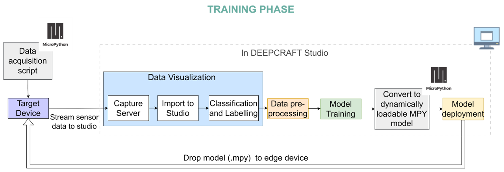
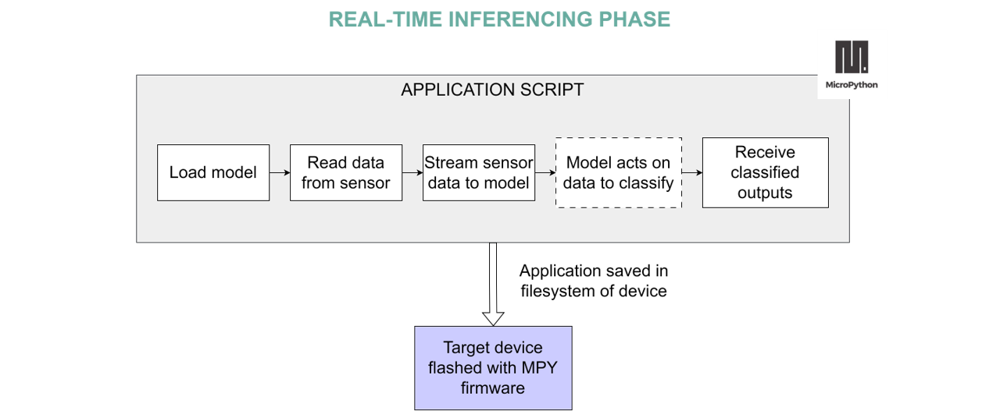
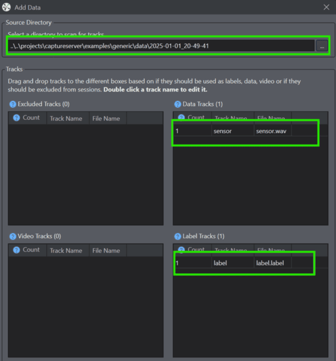
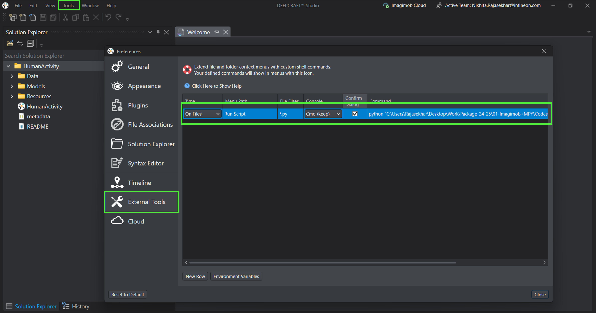

.. _psoc6_mpy_deepcraft_integration:

MicroPython - DEEPCRAFT™ Integration 
^^^^^^^^^^^^^^^^^^^^^^^^^^^^^^^^^^^^^^

DEEPCRAFT™ is Infineon's comprehensive new Edge AI software & tools offering designed to fastrack edge machine learning 
application development.

DEEPCRAFT™ Studio is a development platform for AI on edge devices. It provides unique modeling capabilities 
to make a custom edge AI models for PSoC based hardware. It's integration with MicroPython allows easy end-to-end 
application development and deployment journey. 

Follow along to build your first edgeML application with MicroPython and DEEPCRAFT™ integration 🚀

Overview
=========
Like any typical edge ML application workflow, this solution also revolves around two key phases — training and inferencing 
— with the training phase handled seamlessly in DEEPCRAFT™ Studio.

The diagrams below illustrate the detailed workflows for each of these phases, outlining the 
tools and steps involved from data acquisition to model deployment.

In the training phase, the edge device runs a micropython application script that streams raw sensor data to a host machine. A capture server on the host 
listens for this incoming data and saves it as timestamped files. This recorded dataset is then imported into the development studio,
where it is labeled, preprocessed, and used to train a machine learning model tailored to the application. With MicroPython integration, the trained model 
can be seamlessly converted into a runtime-loadable format and deployed to the device's filesystem. Since achieving optimal accuracy often requires iterative tuning, 
this streamlined model conversion and deployment process significantly reduces friction in the development cycle.

Once the model achieves satisfactory accuracy, it is ready for integration into the final application. In this phase, a MicroPython script saved on filesystem of edge device,
typically handles sensor data acquisition and feeds it to the dynamically loaded model. The pre-trained model processes the input and outputs class probabilities 
based on the learned patterns. Depending on the application, these outputs can be used to trigger actions via peripherals (e.g., LEDs, buzzers) or be 
streamed to external interfaces such as a web dashboard for visualization.

With this development workflow in place, let's begin building a complete EdgeML application step by step.

Pre-requisites
================

Ensure the following are available and installed as needed :

1. `DEEPCRAFT™ Studio <https://softwaretools.infineon.com/tools/com.ifx.tb.tool.deepcraftstudio>`_ 
2. `Capture Server cloned in your local <https://bitbucket.org/imagimob/captureserver/src/master/>`_

Tested Boards
================
- `CY8CKIT-062S2-AI <https://www.infineon.com/cms/en/product/evaluation-boards/cy8ckit-062s2-ai/>`_

1. Data acquisition 
======================

Setup & Installation
---------------------
1. Flash the micropython device with firmware using the `mpy-psoc6.py utility <https://ifx-micropython.readthedocs.io/en/latest/psoc6/installation.html>`_.

2. Clone the repository to get data acquisition scripts:

.. code-block:: python

    git clone https://gitlab.intra.infineon.com/epe-sw/innovation/edgeml/imagimob-mpy-app.git 

and open data_acquisition.py script in MPY supported IDES's like thonny IDE.

3. Clone the captureserver repo:

.. code-block:: python
    
    git clone https://bitbucket.org/imagimob/captureserver/src/master/ 
    
and follow the instruction to setup.

Steps
------
While the capture server supports multiple data acquisition interfaces, this integration currently enables only
TCP, allowing wireless streaming of data from the edge device to the host machine.

1. To enable Wi-Fi-based data streaming from your edge device to the host, update the data_acquisition.py script
with your network credentials:

.. code-block:: python

    SSID = "your_wifi_name"
    PASSWORD = "your_wifi_password"

2. Navigate to the generic folder in the cloned capture server repository:

.. code-block:: bash

    cd examples/generic

3. To start the capture server using TCP, run the following command (update parameters as needed):

.. code-block:: bash

    python generic_local_capture_interface.py --output-dir "output directory location" --protocol TCP --ip-address "IP address" --port 5000  --data-format ".data or .wav based on sensor output" --data-type "expected sensor data type" --samples-per-packet "sensor values in a single output" --features "no. of sensor features" --sample-rate "sampling-rate" --video-disabled.

To know about each parameters, please check the `documentation <https://bitbucket.org/imagimob/captureserver/src/master/>`_.

4. Open Deepcraft Studio and either create a new project or open an existing one. Navigate to the DATA tab and click the Add Data button. Select the output directory where the captured .wav or .data and associated label files were saved.

.. image:: img/training_add_data.png
    :width: 800px

5. Upon selection, the studio will automatically detect and load the audio/data and label files into a new data session.

6. Once the data session is created, your dataset is now available inside the studio and ready for preprocessing, labeling, and model training.

.. image:: img/training_data_session.png
    :width: 800px

2. Model deployment
=====================

Setup & Installation
---------------------
1. Clone deepcraft-micropython-converter repository from the root of your DEEPCRAFT™ project.

.. code:: bash

    git clone https://github.com/Infineon/deepcraft-micropython-converter/tree/main

2. To make the script executable directly from the DEEPCRAFT™ Studio environment:

- Go to the Tools tab and select ``Options``.
- Navigate to ``External Tools``.
- Click ``New Row`` to add a custom command to the file context menu.
- Set the following parameters::

    File Filter: *.py
    Console: Cmd (keep)
    Confirm dialog: Checked
    Command: python "path to deepcraft_micropython_converter script" ; where python is the interpreter and expected to be installed in your environment

Steps
------
1. Once you are ready with your model to be deployed, simply right-click on the deepcraft_micropython_converter.py script and click on ``Run``.
This will generate a deepcraft_model.mpy which you can directly drop to your edge device.

    Placeholder to add image!!

2. To drop the model to your edge device, open a Micropython supported IDE like Thonny and select this model from local. Right click and select ``Upload to \``

Our published projects
=======================

Placeholder to add hackster/DEEPCRAFT™ newsletter links!!
